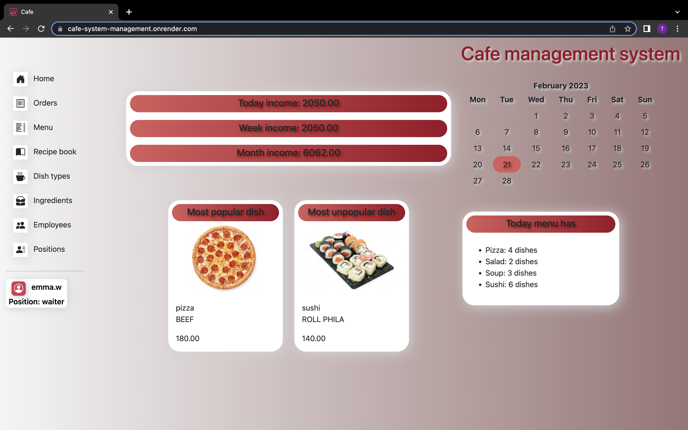
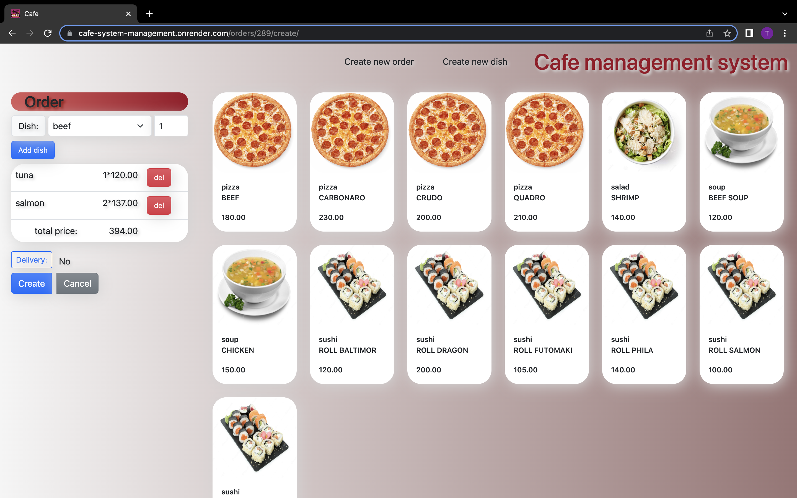

# Cafe mangment system
This project help restaurants, cafes, sushi-bars etc. manage their employee, warehouse, orders. You can manage menu with dishes and recipes for them, hire new employees and dismiss them, create orders and don't be afraid if ingredients not enough in the warehouse.




## Check It

[Cafe management system deployed to Render](https://cafe-system-management.onrender.com/)


## To run the project
1. Clone the repo
    ```
    git clone the_copied_link
    ```
2. Python 3 must be installed
3. Open the project folder in your IDE
4. Open a terminal in the project folder and run
    ```
    python -m venv venv
    venv\Scripts\activate (on Windows)
    source venv/bin/activate (on macOS)
    pip install -r requirements.txt
    python manage.py migrate
    python manage.py runserver # starts Django server
    
    ```
5. Fixtures will be uploaded automatically 

6. Don't forget to create and fill cafe/.env. How to fill it you can see in .env_sample

6. After loading fixture you can use superuser:
    login: admin.user
    pass: 1qazcde3
    Or you always can create new superuser/employee to use.

## Features

- Authentication functionality for Employee/User
- Powerful managing ingredients, dishes, orders directly from website
- Control for amount of ingredients
- Admin panel for advanced managing

## Structure


